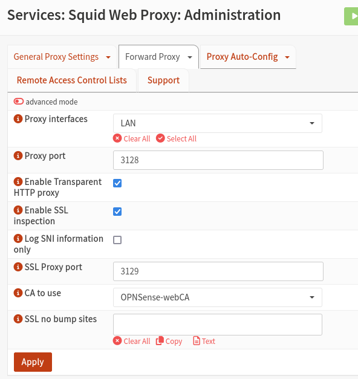
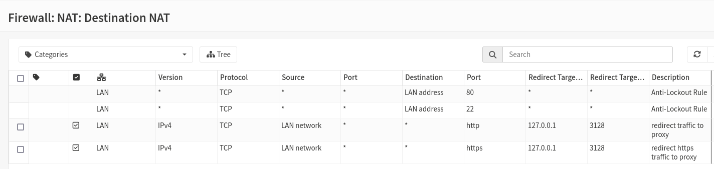
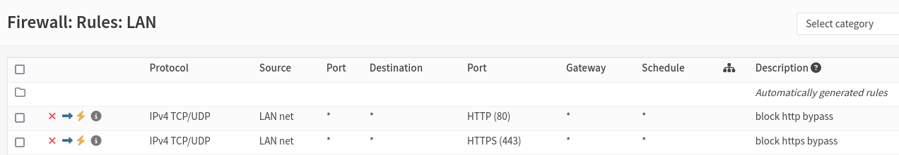
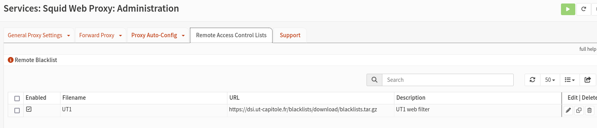
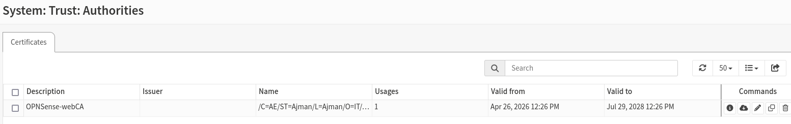
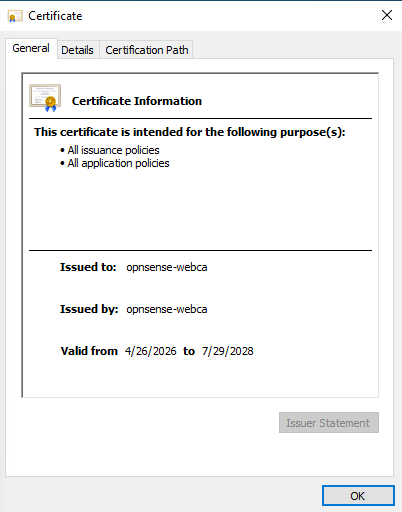
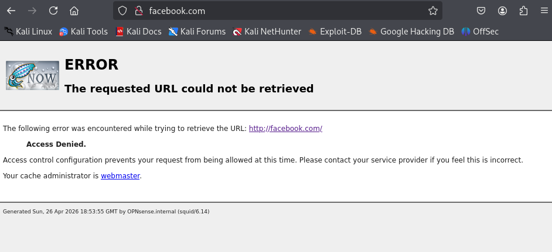

# Web Filtering with OPNsense (Squid Proxy)

## 1. Overview
This lab implements a **transparent web proxy with blacklist-based filtering** using OPNsense.

The goal is to:
- Route all client traffic through a proxy
- Apply category-based restrictions (e.g., social networks)
- Prevent users from bypassing filtering controls

## 2. Network Flow
  Client → OPNsense → NAT Redirect → Squid Proxy → Internet 

  All client traffic is intercepted by OPNsense and redirected to the proxy for inspection before reaching the internet.

## 3. Proxy Configuration

### What was done
The Squid proxy was configured in **transparent mode**, allowing clients to be filtered without manual proxy configuration.

SSL inspection was also enabled to attempt filtering HTTPS traffic.

### Why
- Transparent proxy ensures **all users are forced through the proxy**
- SSL inspection allows visibility into HTTPS traffic (required for modern websites)

### Configuration
- Interface: LAN  
- Proxy Port: 3128  
- Transparent HTTP Proxy: Enabled  
- SSL Inspection: Enabled  
- SSL Proxy Port: 3129  
- CA Certificate: OPNsense-webCA  

### Screenshot

## 4. NAT Redirection Rules

### What was done
Destination NAT rules were created to redirect all web traffic to the proxy.

### Why
Without NAT redirection, users could directly access the internet and bypass the proxy.

### Rules
- HTTP (80) → 127.0.0.1:3128  
- HTTPS (443) → 127.0.0.1:3128  

This forces all web traffic into the proxy.

### Screenshot

## 5. Firewall Rules (Bypass Prevention)

### What was done
Firewall rules were created to block direct HTTP and HTTPS traffic.

### Why
These rules are meant to:
- Prevent users from bypassing the proxy
- Enforce that all traffic must go through filtering

### Rules
- Block HTTP (80)  
- Block HTTPS (443)  

### Important Note
If SSL interception is not fully working, these rules may:
- Block traffic before it reaches the proxy
- Cause connection failures instead of block pages

### Screenshot

## 6. Blacklist Configuration

### What was done
A categorized blacklist (University of Toulouse) was downloaded and applied.

Only the **social_networks** category was selected.

### Why
This allows selective blocking instead of blocking all traffic.

Example:
- Facebook → Blocked  
- Other categories → Allowed  

### Screenshot

## 7. SSL Certificate (HTTPS Inspection)

### What was done
A Certificate Authority (CA) was created in OPNsense and installed on the Windows client.

### Why
HTTPS traffic is encrypted.  
To inspect it, the proxy must:
- Decrypt traffic (MITM)
- Re-encrypt it using a trusted certificate

Without this:
- Browsers will show certificate errors

### Important Note
This step is only required for:
- HTTPS filtering

It is NOT required for:
- HTTP-only filtering (e.g., Kali testing)

### Screenshots
  

## 8. Testing Results

### Kali Linux (Successful Filtering)

### What happened
When accessing a blocked site (e.g., Facebook): Access Denied

### Why it worked
- Traffic was successfully redirected to proxy
- Proxy applied blacklist rules
- HTTP traffic allowed full inspection

### Screenshot

### Windows 11 (Observed Behavior)

### What happened
- HTTPS sites did not show block page
- Instead showed: ERR_SSL_PROTOCOL_ERROR

### Why this happened
Modern browsers enforce:
- HTTPS (HSTS)
- Certificate pinning
- Strict TLS validation

As a result:
- HTTPS interception must be perfectly configured
- Otherwise, traffic fails instead of showing a block page

## 9. Key Findings

- Transparent proxy works reliably for HTTP filtering  
- HTTPS filtering is significantly more complex  
- Firewall rules can override proxy behavior if misconfigured  
- Modern browser security limits transparent filtering effectiveness  

## 10. Conclusion

The lab successfully demonstrates:

- Transparent proxy deployment  
- Blacklist-based filtering  
- Enforcement of web access control  

While HTTPS filtering showed limitations, the system behaves consistently with real-world network environments.

## Future Work

- Wazuh Deployment and Agents

## Notes

- The CA certificate is only required for HTTPS interception  
- Kali testing did not require the certificate because it relied on HTTP filtering  

