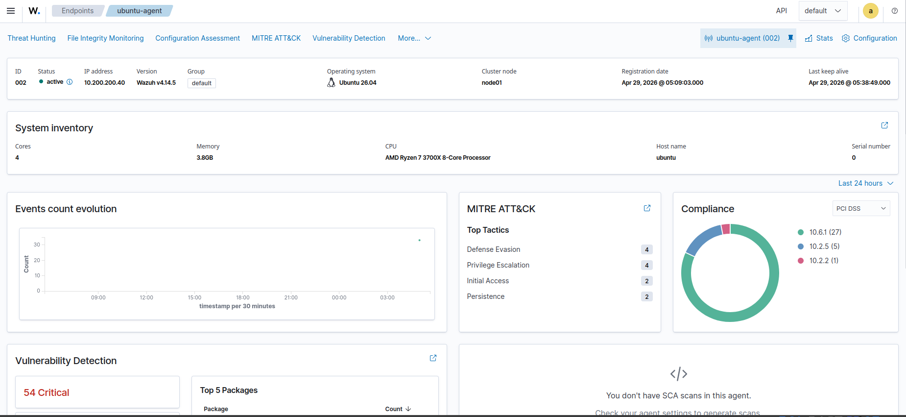
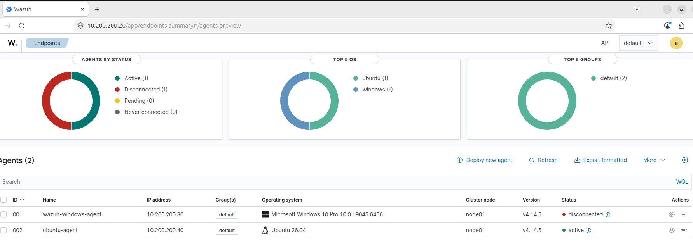

# Wazuh SIEM Deployment and Agent Integration

## 1. Overview

This lab focused on deploying a functional Wazuh SIEM environment and integrating multiple endpoints into a centralized monitoring system.

The objective was to:
- Establish a working SIEM platform
- Configure reliable static networking across systems
- Integrate heterogeneous endpoints (Windows and Ubuntu)
- Validate centralized visibility of agents and system activity

This lab forms the foundation for future attack simulation and detection exercises.


## 2. Wazuh Deployment

Wazuh was successfully deployed as the central monitoring platform within the lab environment.

The dashboard was accessed via:
```
https://10.200.200.20
```

The deployment included:
- Wazuh Manager (log collection and analysis)
- Wazuh Indexer (data storage and search)
- Wazuh Dashboard (visualization and management)

HTTPS was required for access, and a self-signed certificate warning was expected and accepted.


## 3. Network Design and Configuration

A fully static IP-based network was implemented to ensure predictability and control.

### Network Configuration
```
Network: 10.200.200.0/24
Gateway: 10.200.200.254
DNS:     10.200.200.254
```

### Assigned Hosts
```
Wazuh   → 10.200.200.20
Windows → 10.200.200.30
Ubuntu  → 10.200.200.40
```

All systems were connected through an internal network, with routing handled by OPNsense. Static addressing removed reliance on DHCP and ensured consistent endpoint identification.


## 4. Ubuntu Static IP Implementation

Ubuntu Server was configured using netplan, which required careful handling due to its YAML-based structure.

Key actions taken:
- Disabled DHCP on all interfaces
- Assigned a static IP to the internal network interface
- Configured gateway and DNS to route through the firewall

An issue was encountered where the IP configuration reset after reboot. This was traced to cloud-init overriding manual network settings.

Resolution involved:
- Disabling cloud-init network configuration
- Removing conflicting netplan files
- Applying a clean and correctly formatted YAML configuration

This ensured persistence of the static IP configuration across reboots.


## 5. Agent Integration

### Windows Agent

The Windows endpoint was integrated using the Wazuh deployment interface. A generated PowerShell command was executed on the host, enabling automatic registration with the Wazuh server.

The process was straightforward and required minimal manual configuration. The agent successfully appeared as active within the dashboard.

### Ubuntu Agent

The Ubuntu agent was deployed using the Linux DEB (amd64) package.

Observations:
- Installation required execution via terminal or SSH
- Manual service management was required to start and enable the agent
- Stable network configuration was critical for successful connection

Once configured, the Ubuntu system successfully registered and appeared as active within Wazuh.


## 6. Verification

Successful deployment was confirmed through:
- Active agent status in the Wazuh dashboard
- Consistent connectivity across all systems
- Proper communication between endpoints and the SIEM

### Dashboard View


### Agent Status



## 7. Key Lessons Learned

### Network Stability is Critical
Static IP addressing is essential in controlled lab environments. Misconfiguration leads to inconsistent connectivity and failed integrations.

### Hidden System Services Can Override Configuration
Cloud-init demonstrated how underlying services can override manual configurations, emphasizing the need to understand system-level behavior.

### YAML Configuration Requires Precision
Netplan configuration is highly sensitive to formatting. Incorrect indentation can invalidate the configuration without clear errors.

### Resource Management Matters
Running multiple virtual machines simultaneously highlighted the importance of balancing CPU and memory allocation to maintain stability.

### Centralized Monitoring Provides Visibility
Integrating multiple endpoints into Wazuh demonstrated the effectiveness of centralized logging and monitoring for detecting and analyzing system activity.


## 8. Next Steps

With the SIEM environment fully operational, the next phase will focus on:
- Introducing a vulnerable target machine (e.g., Metasploitable)
- Performing controlled attacks from Kali Linux
- Observing and analyzing generated logs in Wazuh
- Validating detection capabilities and alert generation

This will transition the lab from deployment to active security testing and analysis.


## 9. Conclusion

The lab successfully established a working Wazuh SIEM environment with integrated Windows and Ubuntu agents.

Key outcomes:
- Reliable static network configuration
- Successful multi-platform agent integration
- Functional centralized monitoring system

This setup provides a strong foundation for further work in attack simulation, threat detection, and security analysis.
