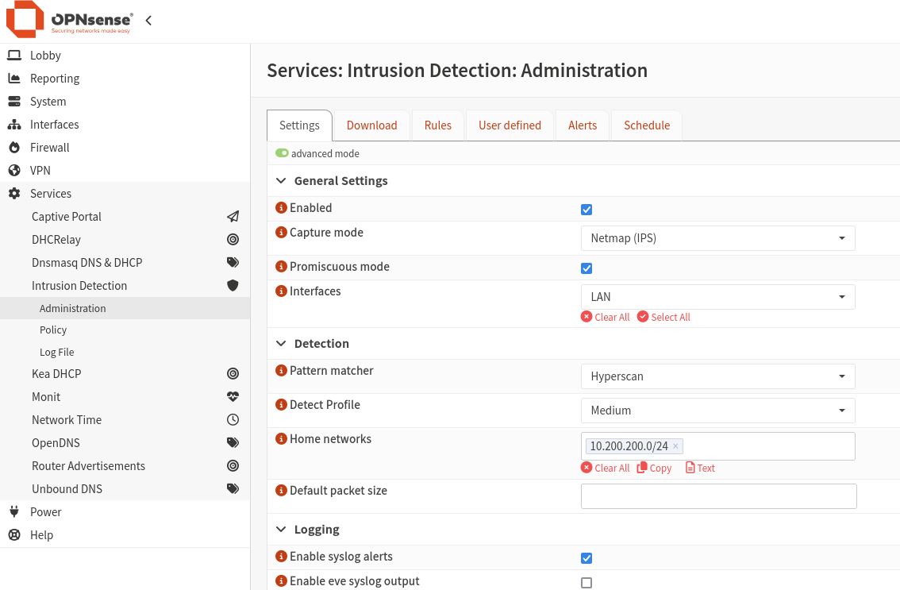
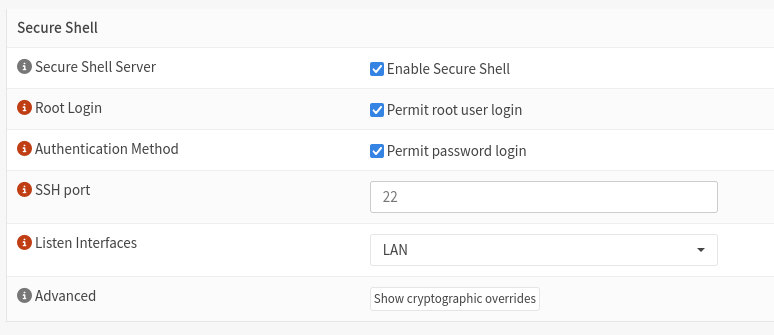
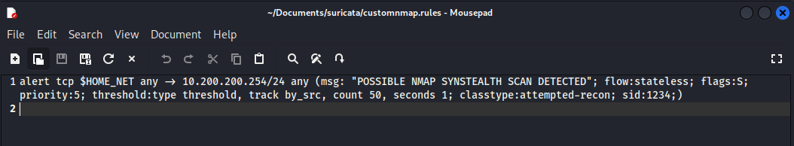
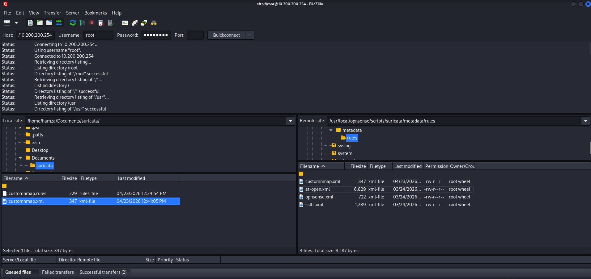
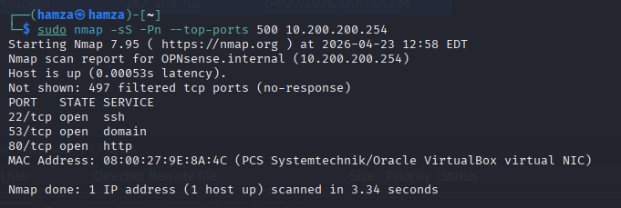
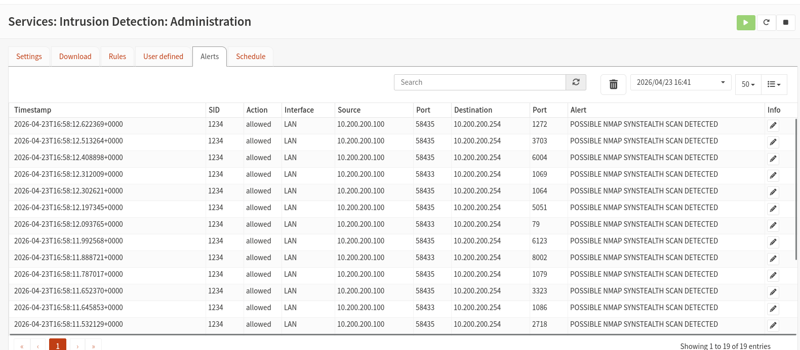

# OPNsense IDS/IPS Lab – Custom Nmap Detection

## 1. Overview

This lab demonstrates the implementation of an Intrusion Detection and Prevention System (IDS/IPS) using OPNsense. A custom Suricata rule was created to detect Nmap SYN stealth scans targeting the firewall. The lab validates detection by generating scan traffic from a Kali Linux machine and observing alerts within OPNsense.

---

## 2. Objectives

- Configure IDS/IPS functionality in OPNsense  
- Enable SSH access for remote file management  
- Create and deploy a custom Suricata rule  
- Host rule files via a local HTTP server  
- Import and activate the rule within OPNsense  
- Simulate reconnaissance activity using Nmap  
- Validate detection through IDS alerts  

---

## 3. Lab Architecture Summary

- **Firewall:** OPNsense (LAN: 10.200.200.254)  
- **Attacker Machine:** Kali Linux (10.200.200.x)  
- **Detection Engine:** Suricata (built into OPNsense)  
- **Rule Hosting:** Python HTTP server on Kali  
- **File Transfer:** SFTP using FileZilla  

---

## 4. IDS/IPS Configuration

IDS/IPS was enabled through the OPNsense interface with the following key settings:

- Intrusion Detection: Enabled  
- IPS Mode: Enabled (Netmap)  
- Promiscuous Mode: Enabled  
- Pattern Matcher: Hyperscan  
- Detection Profile: Medium  
- Interface: LAN  
- Home Network: 10.200.200.0/24  

---

## 5. Enabling SSH Access

SSH access was enabled to allow remote file transfer and system interaction.

- SSH enabled under system administration settings  
- Root login permitted (lab environment only)  
- Password authentication enabled  
- Port: 22  

---

## 6. Custom Rule Creation

A custom Suricata rule was written to detect SYN stealth scans based on:

- TCP SYN packets  
- High frequency (threshold-based detection)  
- Target: Firewall (10.200.200.254)  

---

## 7. Rule Deployment via FileZilla

FileZilla was used to establish an SFTP connection to the OPNsense firewall.

- Connected using root credentials  
- Navigated to Suricata rules directory  
- Uploaded XML rule definition file  

---

## 8. Hosting Rule Files

A simple HTTP server was used on the Kali machine to host the custom rule file so that OPNsense could retrieve it.

---

## 9. Rule Activation

Within OPNsense:

- Custom ruleset was enabled  
- Rules were downloaded and updated  
- Rule became visible in the rules section  

---

## 10. Attack Simulation (Nmap Scan)

A SYN stealth scan was executed from the Kali machine targeting the firewall.

---

## 11. Detection Results

The IDS successfully detected the scan and generated alerts.

- Multiple alerts triggered  
- Source identified as Kali machine  
- Destination: OPNsense firewall  
- Classification: Attempted Reconnaissance  

---

## 12. Key Learnings

- IDS detects suspicious activity based on predefined signatures  
- IPS can extend this by actively blocking traffic  
- Rule accuracy is critical; incorrect syntax prevents detection  
- Network path and interface selection directly impact visibility  
- Custom rules provide flexibility beyond default rule sets  
- Hosting and ingestion of rules requires proper integration between systems  

---

## 13. Challenges Encountered

- Rule did not trigger initially due to incorrect syntax  
- File naming mismatch prevented rule download  
- IDS visibility depends on correct interface and traffic flow  
- Understanding Suricata rule structure was essential  

---

## 14. Conclusion

This lab successfully demonstrated the deployment and validation of a custom IDS rule within OPNsense. By simulating reconnaissance activity, the effectiveness of signature-based detection was confirmed. The exercise highlights the importance of correct configuration, rule accuracy, and traffic visibility in network security monitoring.

---

## 15. Next Steps

Future work will focus on expanding the lab with additional network security controls, including web filtering and proxy configuration. These will build on the current IDS/IPS setup to provide greater visibility and control over network traffic.

---
