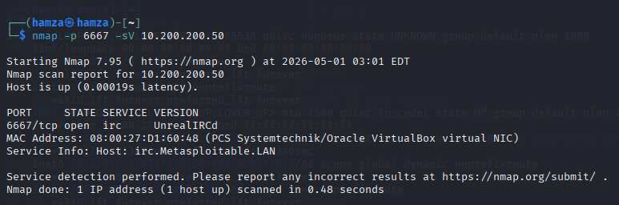
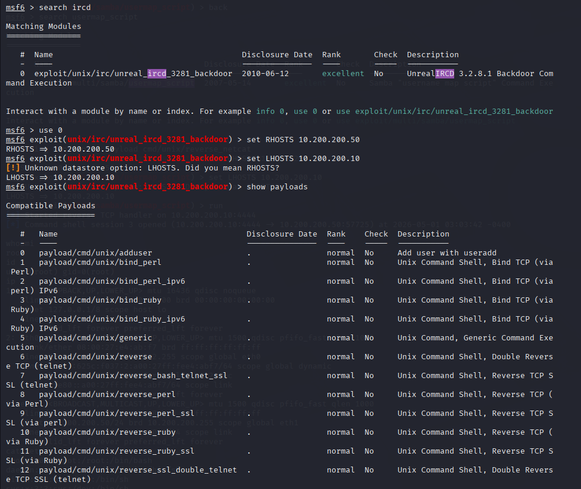
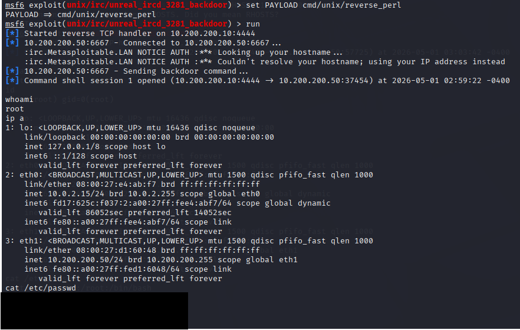

# UnrealIRCd Backdoor Exploitation

## Overview

As part of the reconnaissance phase, Nmap was used to identify open ports and running services on the target system. Port 6667 was found to be open, which is commonly associated with IRC services. Further version detection revealed that the service was running UnrealIRCd 3.2.8.1, a version known to contain a backdoor.

## Vulnerability Explanation

The vulnerability in UnrealIRCd 3.2.8.1 is not a traditional coding flaw but rather the result of a malicious backdoor inserted into the software distribution. This backdoor allows an attacker to execute arbitrary commands on the server by sending a specially crafted message.

Unlike typical vulnerabilities, this one does not rely on bypassing authentication or exploiting memory corruption. Instead, it directly provides a hidden mechanism for command execution.

## Exploitation Process

The Metasploit Framework was used to exploit this backdoor via the module `exploit/unix/irc/unreal_ircd_3281_backdoor`. The target IP address was configured, and a reverse shell payload was selected to allow the target system to connect back to the attacker.

Once executed, the exploit sent a specially crafted command to the IRC service, triggering the backdoor functionality.

  

## Outcome

The exploit successfully returned a shell from the target system, demonstrating remote command execution. This confirms the presence of the backdoor and highlights the risks associated with compromised or tampered software distributions.

## Lessons Learned

This scenario demonstrates that not all vulnerabilities originate from programming errors; supply chain compromises can introduce critical risks that are difficult to detect through traditional means. It also emphasizes the importance of verifying software integrity and using trusted sources. From a security standpoint, unusual services such as IRC running internally should be monitored closely, as they can provide unexpected attack surfaces.
