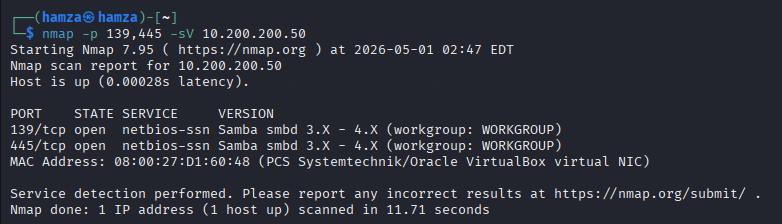
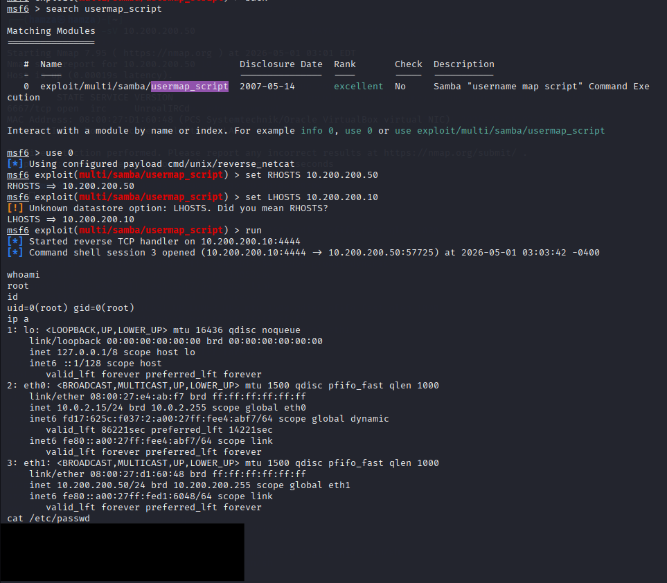

# Samba Exploitation (Username Map Script)

## Overview

During the enumeration phase, an Nmap scan was conducted against the Metasploitable2 machine to identify exposed services and potential attack vectors. The scan revealed that ports 139 and 445 were open, indicating the presence of an SMB service running Samba. The version identified is known to be outdated and vulnerable to a command injection flaw through the username mapping functionality.

## Vulnerability Explanation

The Samba username map script vulnerability exists due to improper input validation when handling username mappings. In certain configurations, Samba allows usernames to be passed through scripts for mapping purposes. However, because the input is not sanitized, an attacker can inject arbitrary system commands into the username field. This results in command execution on the target system with elevated privileges.

## Exploitation Process

To exploit this vulnerability, the Metasploit Framework was used. The module `exploit/multi/samba/usermap_script` targets this specific flaw. The target IP address (Metasploitable2) was configured along with the attacker machine details.

A command execution payload was selected to obtain a shell. When the exploit was executed, a specially crafted request was sent to the Samba service, injecting a command through the vulnerable username mapping mechanism.

## Outcome

The exploit resulted in remote code execution with root privileges on the target machine. This demonstrates the severity of the vulnerability, as no authentication was required and full system access was obtained through a network service.

## Lessons Learned

This exercise highlights how dangerous poor input validation can be in network services, especially when combined with legacy configurations that were not designed with modern security in mind. It also reinforces the importance of regular patching and avoiding outdated software versions in production environments. From a defensive perspective, relying solely on perimeter security is not sufficient, as internal services can still be directly exploited. Proper segmentation and monitoring of internal traffic are necessary to reduce the risk of such attacks.
