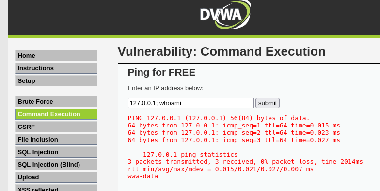
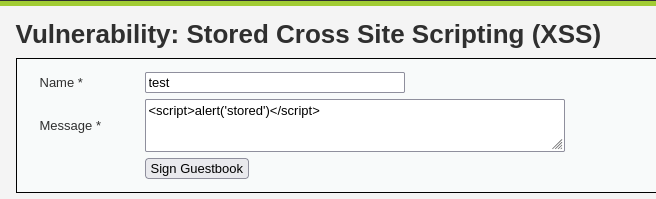
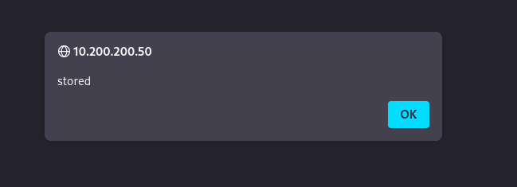
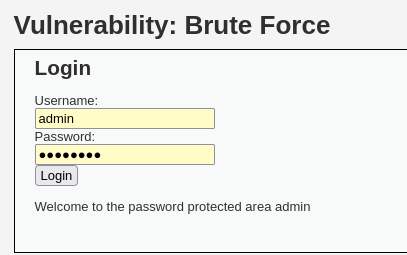

# DVWA Web Application Exploitation

## Overview

The Damn Vulnerable Web Application (DVWA) hosted on the Metasploitable2 machine was used to explore common web application vulnerabilities. After accessing the web interface and setting the security level to low, multiple vulnerabilities were tested, including command injection, SQL injection, file inclusion, file upload, cross-site scripting, and brute force attacks.

## Command Injection

The command injection vulnerability allows user input to be executed as a system command. By appending additional commands using shell operators, arbitrary commands can be executed on the server.

This worked because the application directly passed user input into a system-level function without validation.

## SQL Injection

SQL injection was performed by manipulating input fields to alter the structure of database queries. By using conditions that always evaluate to true, it was possible to bypass logic and retrieve database contents.

The vulnerability exists because user input is directly embedded into SQL queries without sanitization.

## File Inclusion (LFI)

Local File Inclusion was exploited by manipulating a URL parameter to load sensitive system files such as `/etc/passwd`.

This vulnerability occurs because the application allows user-controlled file paths without proper restriction.

## File Upload (Web Shell)

A malicious PHP file containing a system command execution function was uploaded through the file upload feature.

  

After uploading, the file was accessed through the browser and used to execute system commands via URL parameters. This effectively created a persistent backdoor on the system.

## Stored Cross-Site Scripting (XSS)

Stored XSS was performed by injecting a script into the application that is saved and executed whenever the page is loaded.

  

This vulnerability arises because user input is stored and rendered without sanitization, allowing JavaScript execution in the browser.

## Brute Force

The brute force module demonstrated how weak authentication mechanisms can be exploited by repeatedly attempting login credentials.

This attack was possible due to the absence of rate limiting or account lockout mechanisms.

## Lessons Learned

The DVWA exercises highlight how a wide range of web vulnerabilities stem from a common root cause: improper handling of user input. Whether it is command execution, database queries, or browser rendering, failing to validate and sanitize input leads directly to exploitation. This also demonstrates how attackers can chain multiple vulnerabilities together, moving from simple information disclosure to full system compromise. From a defensive perspective, secure coding practices, input validation, and layered security controls such as web application firewalls are essential to mitigate these risks.
