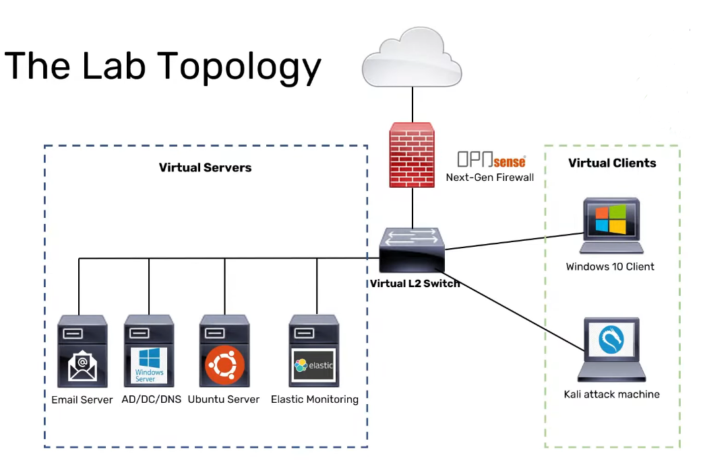
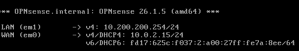
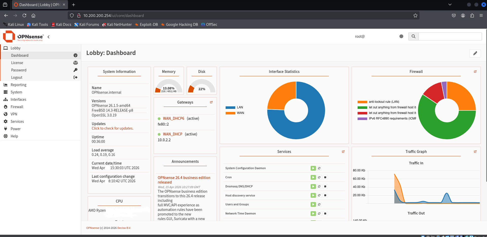
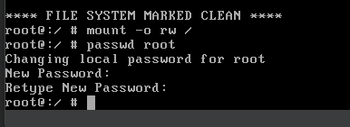

# OPNsense Firewall Deployment (VirtualBox)

## 1. Overview

This project documents the deployment and configuration of an OPNsense firewall within a virtual lab environment. The firewall is used to simulate network segmentation and control traffic between internal and external networks.

## 2. Objectives

- Deploy OPNsense firewall in VirtualBox  
- Configure WAN and LAN interfaces  
- Implement network segmentation  
- Enable NAT-based connectivity  
- Access firewall via web interface  

## 3. Architecture

The firewall acts as a gateway between the internal lab network (LAN) and external network (WAN).

## 4. Implementation

### 4.1 Virtual Machine Setup

- Created VM using BSD / FreeBSD (64-bit)  
- Allocated 2 GB RAM and 8 GB disk  

### 4.2 Network Configuration

- Adapter 1 (WAN): NAT  
- Adapter 2 (LAN): Internal Network (intnet)  

### 4.3 Installation

- Mounted ISO and booted installer  
- Installed using UFS filesystem  
- Set root password  
- Removed ISO and rebooted  

### 4.4 Interface Assignment

- WAN → em0  
- LAN → em1  

### 4.5 LAN Configuration

- IP Address: `10.200.200.254`  
- Subnet: `/24`  
- DHCP disabled  

### 4.6 Web Interface Access

Accessed firewall via:
https://10.200.200.254

## 5. Password Recovery (Troubleshooting)

During testing, the root password was lost and required recovery.

Steps performed:

1. Booted into single-user mode  
2. Ran filesystem check:
   fsck -y /

3. Mounted filesystem:
   mount -o rw /

4. Reset root password:
   passwd root

5. Rebooted system  

This demonstrates basic system recovery and administrative access restoration.

## 6. Validation

- Firewall accessible via web interface  
- LAN interface reachable  
- Internal network configured successfully  
- Interfaces correctly assigned  

## 7. Key Learnings

- Firewalls require at least two interfaces (WAN and LAN)  
- NAT enables controlled internet access  
- Network segmentation improves security  
- Virtual environments can simulate enterprise networks  
- Basic system recovery is essential for administration  

## 8. Future Improvements

- Enable DHCP for LAN clients  
- Configure firewall rules  
- Add IDS/IPS features  
- Integrate logging and monitoring  

---

## 9. Conclusion

This lab demonstrates the deployment and configuration of an OPNsense firewall, including interface setup, network segmentation, and administrative recovery. It provides a foundation for further network security experimentation.
